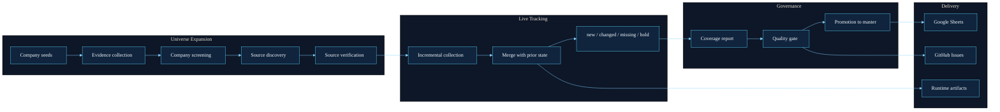
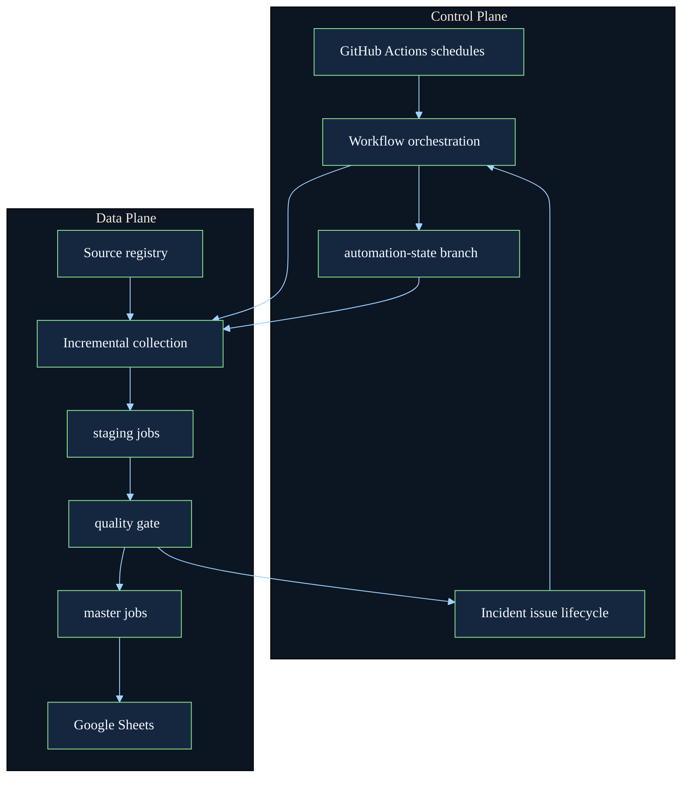

# Biz Voyager

<p align="center">
  
</p>

<p align="center">
  <strong>An operational intelligence system for Korean AI hiring.</strong><br/>
  Discover companies, verify official hiring sources, track job changes over time, and publish quality-gated outputs to Google Sheets.
</p>

<p align="center">
  <a href="https://github.com/mwithgod3952/Biz-Voyager/actions/workflows/jobs_market_v2_daily.yml">
    
  </a>
  <a href="https://github.com/mwithgod3952/Biz-Voyager/actions/workflows/jobs_market_v2_weekly.yml">
    
  </a>
  <a href="https://github.com/mwithgod3952/Biz-Voyager/issues">
    
  </a>
</p>

## Why This Exists

Most hiring dashboards fail in one of two ways:

- they track too few companies, so growth stalls early
- they scrape too aggressively, so data quality and operational trust collapse

Biz Voyager is built to avoid both failures.

It expands the reachable hiring universe, keeps a persistent operating state across GitHub-hosted runners, and publishes only after quality checks pass. The goal is not to collect the noisiest possible job feed. The goal is to maintain a broad, dependable, inspectable hiring intelligence surface.

## What Biz Voyager Actually Does

Biz Voyager runs the full loop behind `jobs_market_v2`:

1. discover companies worth tracking
2. find official careers pages and public ATS endpoints
3. verify which sources are suitable for repeat automation
4. collect and normalize jobs
5. track `new`, `changed`, `missing`, and temporary hold states
6. gate quality before promotion
7. deliver results to Google Sheets

This means the repository is not just “a scraper.”
It is a stateful operations system for job-market monitoring.

## The Core Operating Idea



## What Makes It Different

- **Recall-first, not prematurely narrow**  
  Ambiguous sources are not instantly discarded. Discovery and verification are separated so coverage can grow without forcing low-confidence rows into production.

- **Promotion-based publishing**  
  Collection alone is never treated as “production ready.” Output lands in `staging`, goes through a quality gate, and only then reaches `master`.

- **Stateful automation on ephemeral runners**  
  GitHub-hosted runners are disposable. Biz Voyager restores and persists runtime state so the system can still behave like a continuous collector.

- **Operationally visible**  
  Runtime artifacts, workflow runs, and incident issues make failure modes visible instead of silent.

## Two Loops, Two Jobs

| Loop | Role | Typical Question It Answers | Cadence |
| --- | --- | --- | --- |
| `daily` | freshness loop | “What changed in the known hiring universe?” | every 2 hours |
| `weekly` | expansion loop | “What companies and sources should enter the universe next?” | weekly |

This split is important.

The `daily` loop protects freshness.
The `weekly` loop prevents the universe from stagnating.

## Control Plane vs Data Plane



## Who This Repository Is For

Biz Voyager is a good fit if you are:

- operating a hiring intelligence workflow
- tracking Korean AI, startup, SMB, or growth-company hiring
- reviewing hiring trends from Sheets rather than raw HTML
- forking a working system and adapting it to your own sheet and source universe

It is not aimed at casual one-off scraping.
It is for people who want a repeatable pipeline.

## Repository Map

- [`jobs_market_v2/README.md`](./jobs_market_v2/README.md)  
  Full beginner-friendly project guide for the actual collector

- [`.github/workflows/jobs_market_v2_daily.yml`](./.github/workflows/jobs_market_v2_daily.yml)  
  The freshness loop for already-known sources

- [`.github/workflows/jobs_market_v2_weekly.yml`](./.github/workflows/jobs_market_v2_weekly.yml)  
  The expansion loop for companies and sources

- [`jobs_market_v2/docs/PRODUCTION_DEPLOY.md`](./jobs_market_v2/docs/PRODUCTION_DEPLOY.md)  
  Deployment and runtime expectations

- [`jobs_market_v2/docs/HANDOFF.md`](./jobs_market_v2/docs/HANDOFF.md)  
  Latest operating notes and current state

- [`jobs_market_v2/runtime/`](./jobs_market_v2/runtime/)  
  Generated outputs, state snapshots, quality summaries, and run logs

## If You Want To Use It Quickly

Start here:

```bash
cd jobs_market_v2
./scripts/setup_env.sh
./scripts/register_kernel.sh
./.venv/bin/python -m jobs_market_v2.cli doctor
```

Then read:

- [`jobs_market_v2/README.md`](./jobs_market_v2/README.md)

That README is the practical operator guide.
This root page is the system-level overview.

## Fork Setup

If you fork Biz Voyager, do not reuse the original operational targets.
A fork should have its own credentials and its own output destinations.

### Local manual runs

Use:

- [`jobs_market_v2/.env.example`](./jobs_market_v2/.env.example)

Create your own local file:

```bash
cd jobs_market_v2
cp .env.example .env
```

Replace at least:

- `GOOGLE_SHEETS_SPREADSHEET_ID`
- `GOOGLE_SERVICE_ACCOUNT_JSON`
- `JOBS_MARKET_V2_LLM_API_KEY`

### GitHub-hosted automation

In your fork, add repository secrets at:

- `Settings -> Secrets and variables -> Actions`

Add:

- `GOOGLE_SHEETS_SPREADSHEET_ID`
- `GOOGLE_SERVICE_ACCOUNT_JSON`
- `JOBS_MARKET_V2_LLM_API_KEY`
- `SLACK_WEBHOOK_URL` if you want Slack alerts

### New Google Sheet

If you create a new target spreadsheet, also share it with your service account email as an editor.
Without that access, collection may succeed but sheet sync will fail.

## What Success Looks Like

When Biz Voyager is healthy:

- the `daily` run keeps known sources fresh
- the `weekly` run keeps the universe expanding
- `staging` changes are visible
- `master` reflects only quality-approved output
- Google Sheets mirrors the promoted result
- repeated failures leave a visible incident trail

## Operating Surfaces

- [GitHub Actions](https://github.com/mwithgod3952/Biz-Voyager/actions)
- [GitHub Issues](https://github.com/mwithgod3952/Biz-Voyager/issues)

## Final Orientation

Use this repository if you want a living hiring intelligence system.

Use [`jobs_market_v2/README.md`](./jobs_market_v2/README.md) if you want to run or modify the collector.

Use the workflow files if you want to understand how automation is scheduled.

Use the docs under [`jobs_market_v2/docs/`](./jobs_market_v2/docs/) if you want the current operating state and deployment details.
