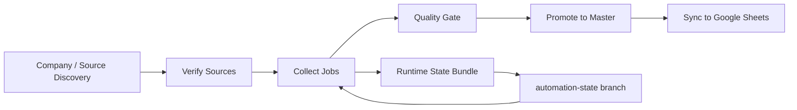

# Biz Voyager

<p align="center">
  
</p>

<p align="center">
  <strong>국내 AI 채용시장을 넓게 탐색하고, 품질 게이트를 통과한 공고만 시트에 반영하는 자동 수집 운영 저장소</strong>
</p>

<p align="center">
  <a href="https://github.com/mwithgod3952/Biz-Voyager/actions/workflows/jobs_market_v2_daily.yml">
    
  </a>
  <a href="https://github.com/mwithgod3952/Biz-Voyager/actions/workflows/jobs_market_v2_weekly.yml">
    
  </a>
  <a href="https://github.com/mwithgod3952/Biz-Voyager/issues">
    
  </a>
</p>

## What This Repo Does

Biz Voyager는 국내 AI 채용시장 데이터를 운영 가능한 형태로 모으기 위한 저장소입니다.  
공식 채용 페이지, 공개 ATS, JSON-LD, RSS, sitemap만 사용하고, 애매한 source는 바로 버리지 않고 검증과 품질 게이트를 거쳐 `staging -> master -> Google Sheets` 경로로 반영합니다.

핵심 목적은 두 가지입니다.

- 이미 확보한 source를 2시간마다 추적해서 신규, 유지, 변경, 미발견을 반영
- 주 1회 더 넓은 회사/source 모집단을 다시 훑어 모집단 자체를 확장

## How It Runs



- `daily`: 2시간마다 운영 추적
- `weekly`: 주 1회 모집단 확장
- `automation-state` branch: GitHub runner가 휘발성이어도 runtime state를 복원하도록 유지
- 실패가 반복되면 issue를 남기고, 성공하면 자동으로 닫도록 설계

## What Makes It Different

- **Recall-first sourcing**: 초기에 source를 과하게 버리지 않고 `candidate`까지 관리합니다.
- **Quality-gated publishing**: low-quality row는 그대로 `master`에 올리지 않습니다.
- **Stateful GitHub Actions**: ephemeral runner 위에서도 runtime state를 보존합니다.
- **Google Sheets delivery**: 운영 결과가 사람이 보기 쉬운 시트로 이어집니다.

## Repository Map

- [`jobs_market_v2/README.md`](./jobs_market_v2/README.md)
  - 프로젝트 상세 사용법과 CLI/노트북 실행 가이드
- [`.github/workflows/jobs_market_v2_daily.yml`](./.github/workflows/jobs_market_v2_daily.yml)
  - 운영 추적용 자동화
- [`.github/workflows/jobs_market_v2_weekly.yml`](./.github/workflows/jobs_market_v2_weekly.yml)
  - 모집단 확장용 자동화
- [`jobs_market_v2/docs/PRODUCTION_DEPLOY.md`](./jobs_market_v2/docs/PRODUCTION_DEPLOY.md)
  - 운영 배포 절차
- [`jobs_market_v2/docs/HANDOFF.md`](./jobs_market_v2/docs/HANDOFF.md)
  - 최신 운영 상태와 handoff 기록

## Current Operating Model

### Daily

- 2시간마다 실행
- 기존 verified source 재방문
- 신규, 변경, 미발견 추적
- 품질 통과 시 `master`와 Google Sheets 반영

### Weekly

- 주 1회 실행
- 회사 / source 모집단 확장
- coverage 점검
- 확장 결과를 `staging`에 반영

## Data Principles

- 공식 공개 source만 사용
- 채용 포털 직접 수집 및 우회성 접근 금지
- low-quality output은 승격보다 보류를 우선
- 수집 성공보다 운영 안정성과 품질 보존을 우선

## Quick Start

```bash
cd jobs_market_v2
./scripts/setup_env.sh
./scripts/register_kernel.sh
./.venv/bin/python -m jobs_market_v2.cli doctor
```

Notebook이 필요하면:

```bash
cd jobs_market_v2
./scripts/run_jupyter.sh
```

## Outputs

주요 산출물은 아래 경로에 쌓입니다.

- `jobs_market_v2/runtime/staging_jobs.csv`
- `jobs_market_v2/runtime/master_jobs.csv`
- `jobs_market_v2/runtime/source_registry.csv`
- `jobs_market_v2/runtime/quality_gate.json`
- `jobs_market_v2/runtime/runs.csv`

## Status Surfaces

- [Actions](https://github.com/mwithgod3952/Biz-Voyager/actions)
- [Issues](https://github.com/mwithgod3952/Biz-Voyager/issues)

실패는 Actions에서 보이고, 반복 실패나 incident는 Issues에 남도록 운영합니다.

## Learn More

실제 수집 코드와 상세 운영 문서는 여기서 이어집니다.

- [`jobs_market_v2/README.md`](./jobs_market_v2/README.md)
- [`jobs_market_v2/docs/PRODUCTION_DEPLOY.md`](./jobs_market_v2/docs/PRODUCTION_DEPLOY.md)
- [`jobs_market_v2/docs/WORK_UNITS.md`](./jobs_market_v2/docs/WORK_UNITS.md)
