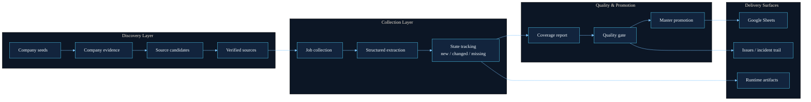
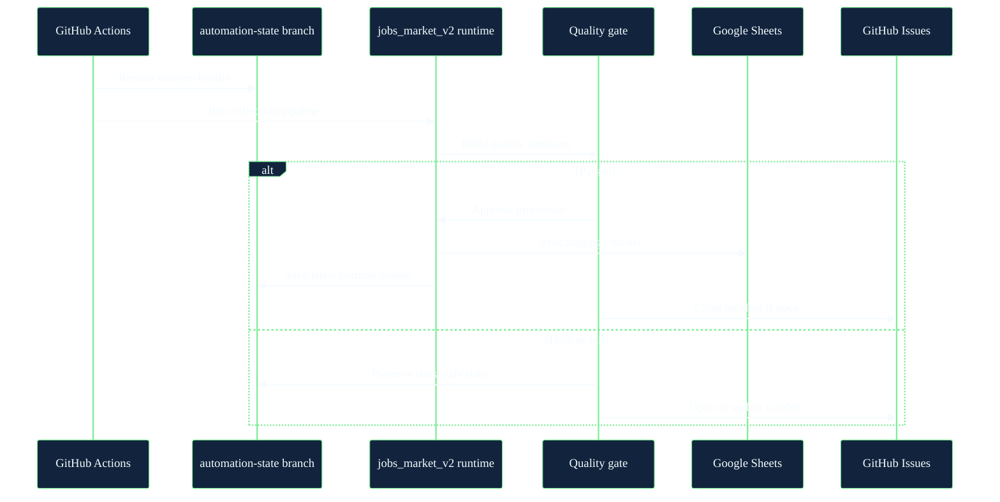

# Biz Voyager

<p align="center">
  
</p>

<p align="center">
  <strong>A production-oriented intelligence pipeline for Korean AI hiring, from source discovery to quality-gated Google Sheets delivery.</strong>
</p>

<p align="center">
  <a href="https://github.com/mwithgod3952/Biz-Voyager/actions/workflows/jobs_market_v2_daily.yml">
    
  </a>
  <a href="https://github.com/mwithgod3952/Biz-Voyager/actions/workflows/jobs_market_v2_weekly.yml">
    
  </a>
  <a href="https://github.com/mwithgod3952/Biz-Voyager/issues">
    
  </a>
</p>

## Overview

Biz Voyager is the operating repository behind `jobs_market_v2`, a live collection system for Korean AI hiring data. It expands the reachable company and source universe, tracks changes over time, and publishes only quality-gated outputs to Google Sheets.

The system is built around a few strict rules:

- Use only official public career pages and public ATS endpoints
- Prefer recall early, then narrow with verification and quality gates
- Keep state between GitHub Actions runs even on ephemeral runners
- Treat publishing as a controlled promotion step, not a side effect of collection

## What The Repository Runs

| Loop | Purpose | Cadence | Output |
| --- | --- | --- | --- |
| `daily` | Revisit already-known sources and track new, changed, and missing jobs | Every 2 hours | `staging -> master -> Google Sheets` |
| `weekly` | Expand the company and source universe, then refresh coverage | Once per week | Expanded `staging` coverage |

## System Architecture



## Execution Model



## Why It Is Built This Way

- **Stateful automation on ephemeral runners**  
  GitHub-hosted runners do not preserve local state, so this repo keeps runtime bundles on the `automation-state` branch and restores them on the next run.

- **Recall-first source expansion**  
  Early stages avoid dropping ambiguous sources too aggressively. The system separates discovery from verification so that coverage can grow without publishing low-confidence rows.

- **Promotion instead of blind overwrite**  
  Collection does not automatically become production output. `staging` is evaluated, then promoted to `master` only after the quality gate passes.

- **Operations visibility**  
  Runtime artifacts, workflow runs, and incident issues provide a visible audit trail when the pipeline fails or degrades.

## Repository Map

- [`jobs_market_v2/README.md`](./jobs_market_v2/README.md)  
  Full project guide, CLI usage, notebook flow, and operating conventions

- [`.github/workflows/jobs_market_v2_daily.yml`](./.github/workflows/jobs_market_v2_daily.yml)  
  The main operational loop for tracking already-known sources

- [`.github/workflows/jobs_market_v2_weekly.yml`](./.github/workflows/jobs_market_v2_weekly.yml)  
  The expansion loop for refreshing the company and source universe

- [`jobs_market_v2/docs/PRODUCTION_DEPLOY.md`](./jobs_market_v2/docs/PRODUCTION_DEPLOY.md)  
  Production deployment notes and runtime expectations

- [`jobs_market_v2/docs/HANDOFF.md`](./jobs_market_v2/docs/HANDOFF.md)  
  Latest working state and handoff notes

## Quick Start

```bash
cd jobs_market_v2
./scripts/setup_env.sh
./scripts/register_kernel.sh
./.venv/bin/python -m jobs_market_v2.cli doctor
```

To open notebooks:

```bash
cd jobs_market_v2
./scripts/run_jupyter.sh
```

## Key Outputs

- `jobs_market_v2/runtime/staging_jobs.csv`
- `jobs_market_v2/runtime/master_jobs.csv`
- `jobs_market_v2/runtime/source_registry.csv`
- `jobs_market_v2/runtime/quality_gate.json`
- `jobs_market_v2/runtime/runs.csv`

## Operating Surfaces

- [GitHub Actions](https://github.com/mwithgod3952/Biz-Voyager/actions)
- [GitHub Issues](https://github.com/mwithgod3952/Biz-Voyager/issues)

The normal path is simple:

- successful runs keep the state bundle fresh
- quality-approved runs publish to Sheets
- repeated failures leave a visible incident trail in Issues

## Learn More

- [`jobs_market_v2/README.md`](./jobs_market_v2/README.md)
- [`jobs_market_v2/docs/PRODUCTION_DEPLOY.md`](./jobs_market_v2/docs/PRODUCTION_DEPLOY.md)
- [`jobs_market_v2/docs/WORK_UNITS.md`](./jobs_market_v2/docs/WORK_UNITS.md)
