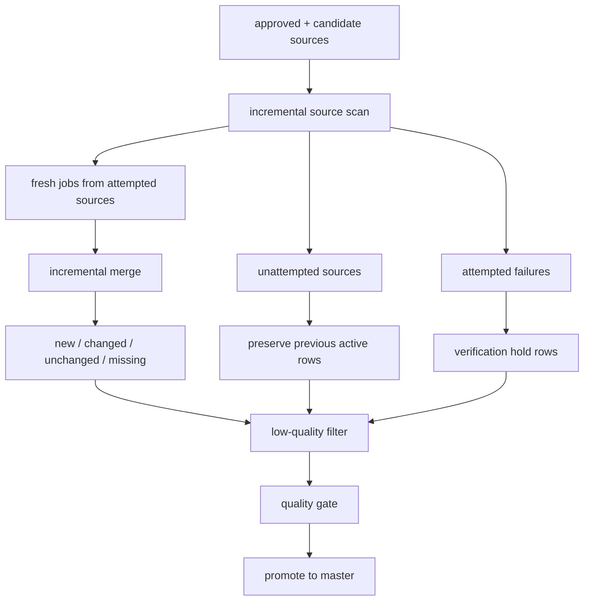

# jobs_market_v2

`jobs_market_v2` is a recall-first job collection system for the Korean hiring market.

It is designed to:

- collect jobs from official careers pages and public ATS endpoints
- preserve a broad candidate universe before narrowing too aggressively
- track `new`, `changed`, `missing`, and temporary hold states over time
- publish only quality-gated results to `master`
- sync the final output to Google Sheets for operational review

This repository is for people who want a practical, inspectable pipeline, not a black box.
If you are new to the project, start with the **Quick Start** section below.

## What This Project Does

This project discovers companies, finds official hiring sources, verifies those sources, collects jobs, and then separates the result into two layers:

- `staging`: the latest collected output before final promotion
- `master`: the promoted output after quality checks

The system only uses sources that are acceptable for long-term automated operation:

- official careers pages
- public ATS pages
- JSON or RSS feeds
- sitemap-discoverable public job pages

It does **not** rely on direct scraping of closed job portals or workaround-style access.

## Who This Is For

This repository is useful if you are:

- running a structured job collection workflow
- expanding a startup / SMB / growth-company hiring universe
- reviewing hiring activity through Google Sheets
- maintaining a repeatable pipeline instead of manually copying jobs

You do **not** need to understand the whole codebase before using it.
You can run it with a small set of commands if your environment is configured correctly.

## System Overview

```mermaid
flowchart LR
    A["Company seeds"] --> B["Company discovery"]
    B --> C["Company evidence collection"]
    C --> D["Company screening"]
    D --> E["Source discovery"]
    E --> F["Source verification"]
    F --> G["Job collection"]
    G --> H["Quality filtering"]
    H --> I["staging"]
    I --> J["Quality gate"]
    J --> K["master"]
    K --> L["Google Sheets"]
```



## Runtime Model



## Project Layout

- `src/jobs_market_v2/`: core application code
- `tests/`: regression and pipeline tests
- `notebooks/`: interactive analysis notebooks
- `runtime/`: generated runtime outputs
- `output_samples/`: sample exports
- `config/`: seed inputs and configuration data
- `scripts/`: setup, execution, and utility scripts

## Quick Start

If you want the shortest path to a working local run, do this:

```bash
cd jobs_market_v2
python3 -m venv .venv
source .venv/bin/activate
./scripts/setup_env.sh
./scripts/register_kernel.sh
```

Then create your `.env` file:

```bash
cp .env.example .env
```

Fill in at least:

- `GOOGLE_SHEETS_SPREADSHEET_ID`
- `GOOGLE_SERVICE_ACCOUNT_JSON`
- `GEMINI_API_KEY` if you want Gemini fallback/refinement

Then run:

```bash
./.venv/bin/python -m jobs_market_v2.cli doctor
./.venv/bin/python -m jobs_market_v2.cli run-collection-cycle
```

If the quality gate passes, sync the result:

```bash
./.venv/bin/python -m jobs_market_v2.cli sync-sheets --target master
./.venv/bin/python -m jobs_market_v2.cli sync-sheets --target staging
```

## Installation

### macOS / Linux

```bash
cd jobs_market_v2
python3 -m venv .venv
source .venv/bin/activate
pip install --upgrade pip
pip install -e .
```

### Windows PowerShell

```powershell
cd jobs_market_v2
python -m venv .venv
.venv\Scripts\Activate.ps1
pip install --upgrade pip
pip install -e .
```

### Recommended Shortcuts

Use the project scripts instead of doing everything by hand:

```bash
./scripts/setup_env.sh
./scripts/register_kernel.sh
./scripts/run_jupyter.sh
```

## Environment Variables

The project reads its local settings from:

- `.env`
- `.env.example` as the template

The two most important values are:

### `GOOGLE_SHEETS_SPREADSHEET_ID`

This is the spreadsheet ID from your Google Sheets URL.

Example:

```text
https://docs.google.com/spreadsheets/d/<SPREADSHEET_ID>/edit
```

### `GOOGLE_SERVICE_ACCOUNT_JSON`

This can be:

- a full JSON string, or
- a path to a local service-account JSON file

Most users find the **file path** option easier.

Example:

```text
GOOGLE_SERVICE_ACCOUNT_JSON=/absolute/path/to/service-account.json
```

### `GEMINI_API_KEY`

Optional, but recommended if you want:

- refinement on weak HTML pages
- fallback assistance for harder role extraction cases

## Google Sheets Setup for Beginners

If Google Sheets is new to you, this is the minimum you need to know.

### Step 1. Create a spreadsheet

Create a Google Sheet that will receive:

- `master tab`
- `staging tab`
- coverage / source / run logs

### Step 2. Find the spreadsheet ID

Open the sheet in your browser and copy the ID from the URL.

### Step 3. Create or obtain a service account JSON

This is a Google Cloud service account key file.
The pipeline uses it to write to your spreadsheet.

### Step 4. Share the sheet with the service account email

This is the step people miss most often.

Open your Google Sheet, click **Share**, and add the service account email as an **Editor**.

If you skip this, collection may still run locally, but sheet sync will fail.

## First-Time Notebook Usage

This project includes two core notebooks.

### Notebook 1: Source Screening

Open:

- `notebooks/00_source_screening.ipynb`

This notebook helps you understand:

- which companies and sources were found
- which sources were approved, candidate, or rejected
- whether the discovery funnel is behaving correctly

### Notebook 2: Bootstrap Population

Open:

- `notebooks/01_bootstrap_population.ipynb`

This notebook helps you inspect:

- the first collected job population
- initial `staging`
- raw detail extraction
- coverage before promotion

### Running Jupyter

```bash
./scripts/run_jupyter.sh
```

Select the kernel:

- `jobs-market-v2`

## Core CLI Commands

If you do not want to use notebooks, these are the main commands to know.

### Discover and screen companies

```bash
python -m jobs_market_v2.cli collect-company-seed-records
python -m jobs_market_v2.cli expand-company-candidates
python -m jobs_market_v2.cli discover-companies
python -m jobs_market_v2.cli collect-company-evidence
python -m jobs_market_v2.cli screen-companies
```

### Discover and verify sources

```bash
python -m jobs_market_v2.cli discover-sources
python -m jobs_market_v2.cli verify-sources
```

### Collect jobs

Bootstrap-style collection:

```bash
python -m jobs_market_v2.cli collect-jobs
```

Dry run:

```bash
python -m jobs_market_v2.cli collect-jobs --dry-run
```

Incremental update:

```bash
python -m jobs_market_v2.cli update-incremental
```

### Promote and sync

```bash
python -m jobs_market_v2.cli promote-staging
python -m jobs_market_v2.cli sync-sheets --target staging
python -m jobs_market_v2.cli sync-sheets --target master
```

### Full operational cycle

```bash
python -m jobs_market_v2.cli run-collection-cycle
```

This is the most useful single command for normal operation.

## What the Output Files Mean

### Runtime job files

- `runtime/staging_jobs.csv`
  - the latest filtered collection result before or after promotion
- `runtime/master_jobs.csv`
  - the promoted dataset used for final review and sheet publishing
- `runtime/raw_detail.jsonl`
  - raw detail payloads collected during job normalization

### Source files

- `runtime/source_registry.csv`
  - the main runtime source registry
- `output_samples/approved_sources.csv`
  - sources allowed for collection
- `output_samples/candidate_sources.csv`
  - sources worth watching but not fully approved yet
- `output_samples/rejected_sources.csv`
  - sources rejected by the screening logic

### Quality / reporting files

- `runtime/quality_gate.json`
  - why promotion passed or failed
- `runtime/coverage_report.json`
  - role / company / source coverage summary
- `runtime/runs.csv`
  - operational history of major pipeline commands

## Understanding Record Status

Each job can move through different states over time.

- `신규`
  - a newly seen job
- `유지`
  - a previously known job with no meaningful change
- `변경`
  - a known job whose content changed
- `미발견`
  - a job that should still belong to a successfully refreshed source but was not found this run
- `검증실패보류`
  - a hold state used when the source attempt itself failed

The important operational rule is:

- jobs should not become `검증실패보류` just because a source was **not attempted** in a partial scan

That distinction is critical for keeping `master` clean and for preserving real incremental growth.

## Recommended Local Workflow

If you are a beginner, follow this order:

1. Run `doctor`
2. Run `discover-sources`
3. Run `verify-sources`
4. Run `update-incremental`
5. Check `runtime/quality_gate.json`
6. Run `promote-staging`
7. Run `sync-sheets --target master`

In practice:

```bash
python -m jobs_market_v2.cli doctor
python -m jobs_market_v2.cli discover-sources
python -m jobs_market_v2.cli verify-sources
python -m jobs_market_v2.cli update-incremental
python -m jobs_market_v2.cli promote-staging
python -m jobs_market_v2.cli sync-sheets --target master
```

## Fork Setup

If you fork this repository, you must replace the original credentials with your own.

### Local manual runs

Edit:

- `jobs_market_v2/.env`

At minimum replace:

- `GOOGLE_SHEETS_SPREADSHEET_ID`
- `GOOGLE_SERVICE_ACCOUNT_JSON`
- `GEMINI_API_KEY` if you use Gemini

### GitHub Actions runs

In your forked repo, open:

- `Settings > Secrets and variables > Actions`

Add:

- `GOOGLE_SHEETS_SPREADSHEET_ID`
- `GOOGLE_SERVICE_ACCOUNT_JSON`
- `GEMINI_API_KEY`
- optional `SLACK_WEBHOOK_URL`

### Important reminder

If you point the project at a new Google Sheet, you must share that sheet with your service-account email as an editor.

## GitHub Actions: Daily vs Weekly

This project supports two different automation roles.

### Daily workflow

Purpose:

- frequent incremental refresh
- track new / changed / missing jobs
- keep `staging` and `master` current

### Weekly workflow

Purpose:

- expand the company and source universe
- refresh source discovery
- widen long-term coverage

In short:

- `daily` keeps the current universe fresh
- `weekly` tries to widen the universe itself

## Troubleshooting

### “The run succeeded locally but nothing changed in Sheets”

Check:

- `runtime/master_jobs.csv`
- `runtime/sheets_exports/master/master_탭.csv`
- the actual Google Sheet row count

If local export is newer than the actual sheet, the issue is usually in the sheet sync step, not in job collection.

### “I see many hold rows”

Check:

- `runtime/quality_gate.json`
- `carry_forward_hold_only_count`
- `carry_forward_hold_ratio`

Large hold counts usually mean one of two things:

- too many source attempts failed
- partial scans are not revisiting the right active sources often enough

### “Google Sheets sync fails”

Usually one of these:

- wrong spreadsheet ID
- service account file path is wrong
- the service account email does not have editor access to the sheet

### “I changed `.env` but nothing happened”

Restart the process you are using.
If you are in a shell with an old environment loaded, the old values may still be active.

## Safety and Data Policy

This project is intentionally conservative about source eligibility.

It is built to be:

- inspectable
- repeatable
- operationally stable

It is **not** designed to maximize raw scraping volume at any cost.

## Validation Commands

Before treating a change as complete, the standard validation sequence is:

```bash
./scripts/setup_env.sh
./scripts/register_kernel.sh
./.venv/bin/pytest -q tests/test_jobs_market_v2.py
./.venv/bin/python -m jobs_market_v2.cli doctor
./.venv/bin/jupyter nbconvert --to notebook --execute runtime/notebook_smoke/00_source_screening.smoke.ipynb --output 00_source_screening.smoke.executed.ipynb --output-dir runtime/notebook_smoke/executed
./.venv/bin/jupyter nbconvert --to notebook --execute runtime/notebook_smoke/01_bootstrap_population.smoke.ipynb --output 01_bootstrap_population.smoke.executed.ipynb --output-dir runtime/notebook_smoke/executed
```

## Where to Go Next

If you are new, use this order:

1. Read this README once
2. Set `.env`
3. Run `doctor`
4. Run `run-collection-cycle`
5. Inspect `runtime/quality_gate.json`
6. Open the Google Sheet

If you are maintaining the pipeline:

1. Watch `runtime/runs.csv`
2. Watch `runtime/source_registry.csv`
3. Watch `runtime/quality_gate.json`
4. Treat stale carry-forward growth pollution as a structural issue, not a one-row issue
